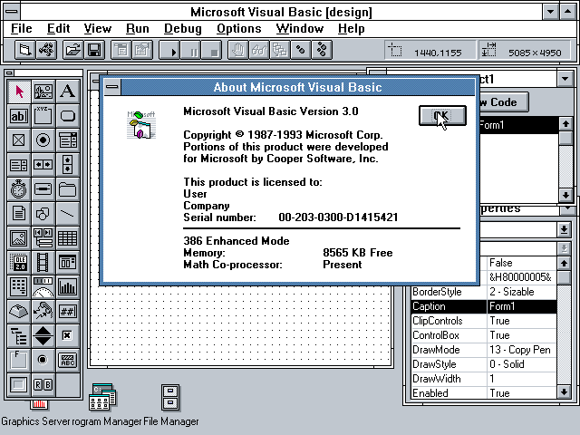
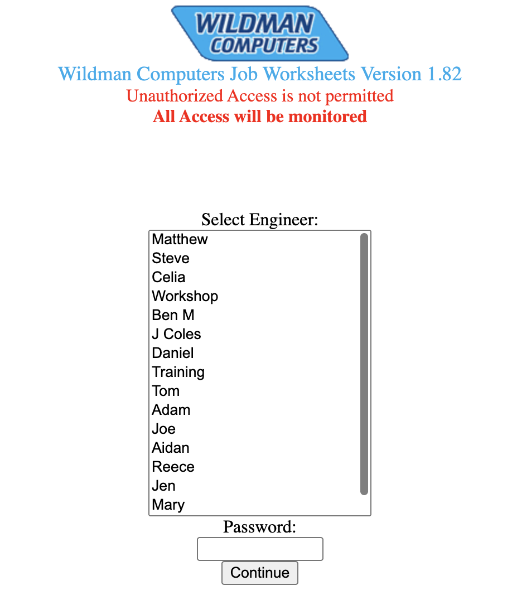

History of PHP (and me)
===================
<!-- column_layout: [2, 2] -->
<!-- column: 0 -->
## PHP
<!-- column: 1 -->
## Me
<!-- pause -->

<!-- column: 0 -->
- (1993) Rasmus Lerdorf wrote helper CGI programs in C to work with forms and databases. He called them Personal Homepage Forms Interpreter or "PHP/FI"
- (1995) Rasmus Lerdorf Open Sourced them as "Personal Home Page Tools (PHP Tools) version 1.0"

```
<!--include /text/header.html-->

<!--getenv HTTP_USER_AGENT-->
<!--if substr $exec_result Mozilla-->
  Hey, you are using Netscape!<p>
<!--endif-->

<!--sql database select * from table where user='$username'-->
<!--ifless $numentries 1-->
  Sorry, that record does not exist<p>
<!--endif exit-->
  Welcome <!--$user-->!<p>
  You have <!--$index:0--> credits left in your account.<p>

<!--include /text/footer.html-->
```

<!-- pause -->
<!-- column: 1 -->
- Wrote my first program on the Commodore 64 Basic (1994)


<!-- end_slide -->

History of PHP (and me)
===================
<!-- column_layout: [2, 2] -->
<!-- column: 0 -->
## PHP
<!-- column: 1 -->
## Me
<!-- pause -->

<!-- column: 0 -->
- (1995) Forms Interpreter
- (1995) Personal Home Page Construction Kit
- (1996) PHP/FI 2.0

<!-- reset_layout -->

```
<?
 $name = "bob";
 $db = "db";
 $result = msql($db,"select * from table where firstname='$name'");
 $num = msql_numrows($result);
 echo "$num records found!<p>";
 $i=0;
 while($i<$num);
    echo msql_result($result,$i,"fullname");
    echo "<br>";
    echo msql_result($result,$i,"address");
    echo "<br>";
    $i++;
 endwhile;
>
```
<!-- end_slide -->
History of PHP (and me)
===================
<!-- column_layout: [2, 2] -->
<!-- column: 0 -->
## PHP
<!-- column: 1 -->
## Me
<!-- pause -->
<!-- column: 0 -->
- (1997) Rewritten parser under a new name
- (1998) PHP: Hypertext Preprocessor 3.0
<!-- column: 1 -->
- (1997) Learned QBasic on DOS 6.22
- (1998) Learned VisualBasic 3 on Windows 3.11
<!-- reset_layout -->



<!-- end_slide -->
History of PHP (and me)
===================
<!-- column_layout: [2, 2] -->
<!-- column: 0 -->
## PHP
<!-- column: 1 -->
## Me
<!-- pause -->
<!-- column: 0 -->
- (2000) PHP 4.0 with Zend Engine - object-oriented programming
- (2001) PHP 4.1 added superglobals
- (2002) PHP 4.2 disable register_globals by default for security
- (2002) PHP 4.3 Introduced PHP CLI

<!-- column: 1 -->
- (~1999) Learned HTML to make a website
- (~2000) Learned PHP - because that's how to make those cool page visit counters
- (2001) Started contributing to online gaming websites - reusable layout and content management
  - Databases
- (2003) My first "professional" system - Wildman Worksheets



<!-- end_slide -->

History of PHP
===================
## PHP
<!-- pause -->
- (2005) PHP 5.0 Zend Engine II - new Object Model, Exception, Interfaces
- (2005) PHP 5.1 PDO database API
- (2006) PHP 5.2 native JSON
- (2006-2009) Mysterious PHP 6 work happening
- (2009) PHP 5.3 namespaces, closures
- (2012) PHP 5.4 traits, short array syntax, built-in webserver
- (2013) PHP 5.5 generators, finally, OpCache performance
- (2014) PHP 5.6 variadic functions
- (2015) PHP 7.0 Zend Engine III, performance and kicked of the era of types
- (2016) PHP 7.1 nullable types, void type
- (2017) PHP 7.2 Sodium library, trailing commas, type widening
- (2018) PHP 7.3 array destructuring, trailing commas, FPM
- (2019) PHP 7.4 Type properties, arrow (short) functions, preloading
- (2020) PHP 8.0 Jit compiler, union type, named arguments
- (2021) PHP 8.1 Enums, readonly properties, Fibers
- (2022) PHP 8.2 readonly classes, null, false and true
- (2023) PHP 8.3 Typed constants
- (2024) PHP 8.4 property hooks, asymmetric visibility for properties, and lazy objects
- (2025) PHP 8.5 pipe operator


<!-- end_slide -->
History of PHP Object model
---


<!-- end_slide -->
PHP 5.0 (2006)
===================

# New Object model brought class type hints
```php +exec
<?php
class YourClass {}
class MyClass {
    function doSomethingWith(YourClass $instanceOfYourObject) {
        echo get_class($instanceOfYourObject).PHP_EOL;
    }
}

$instanceOfMyClass = new MyClass();
$instanceOfMyClass->doSomethingWith(new YourClass);

```

```php +exec
<?php
/// class YourClass {}
/// class MyClass {
///     function doSomethingWith(YourClass $instanceOfYourObject) {
///         echo get_class($instanceOfYourObject).PHP_EOL;
///     }
/// }
/// $instanceOfMyClass = new MyClass();

$instanceOfMyClass->doSomethingWith(new MyClass);
```

<!-- end_slide -->
PHP 5.0 (2006)
===================
# New Object model brought "types" through classes and type hints
```php +exec
<?php
interface MyInterface {}
interface MyInterface2 {}
abstract class MyAbstract {}
class MyClass extends MyAbstract implements MyInterface, MyInterface2 {}

$instanceOfMyClass = new MyClass();
var_dump($instanceOfMyClass instanceof MyClass);
var_dump($instanceOfMyClass instanceof MyInterface);
var_dump($instanceOfMyClass instanceof MyInterface2);
var_dump($instanceOfMyClass instanceof MyAbstract);

var_dump($instanceOfMyClass instanceof NotMyClass);
var_dump($instanceOfMyClass instanceof NotMyInterface);
var_dump($instanceOfMyClass instanceof NotMyAbstract);

function testInterface(MyInterface $instance) {}
function testAbstract(MyAbstract $instance) {}
function testClass(MyClass $instance) {}

testInterface($instanceOfMyClass);
testAbstract($instanceOfMyClass);
testClass($instanceOfMyClass);
```


<!-- end_slide -->
PHP 5.0 (2006)
===================
# New Object model brought "types" through classes and type hints
<!-- column_layout: [1, 1, 1] -->
<!-- column: 0 -->
```php +exec
<?php
/// interface MyInterface {}
/// interface MyInterface2 {}
/// abstract class MyAbstract {}
/// class MyClass extends MyAbstract implements MyInterface, MyInterface2 {}
/// $instanceOfMyClass = new MyClass();


function testFailClass(
    NotMyClass $instance
) {}

testFailClass(
    $instanceOfMyClass
);
```
<!-- column: 1 -->
```php +exec
<?php
/// interface MyInterface {}
/// interface MyInterface2 {}
/// abstract class MyAbstract {}
/// class MyClass extends MyAbstract implements MyInterface, MyInterface2 {}
/// $instanceOfMyClass = new MyClass();


function testFailAbstract(
    NotMyAbstract $instance
) {}

testFailAbstract(
    $instanceOfMyClass
);
```
<!-- column: 2 -->
```php +exec
<?php
/// interface MyInterface {}
/// interface MyInterface2 {}
/// abstract class MyAbstract {}
/// class MyClass extends MyAbstract implements MyInterface, MyInterface2 {}
/// $instanceOfMyClass = new MyClass();


function testFailInterface(
    NotMyInterface $instance
) {}

testFailInterface(
    $instanceOfMyClass
);
```

<!-- end_slide -->
PHP 7.0 (2015)
===================
# Scalar Types
<!-- column_layout: [1, 1] -->
<!-- column: 0 -->
```php +exec
<?php
function whatTypes(...$args)
{
    return implode(
        PHP_EOL,
        array_map(
            'gettype',
            $args
        )
    );
}

echo whatTypes("Hello", 1, 3.14, false, [1, 2, 3, 4], new stdClass(), stream_context_create());
```
<!-- pause -->
<!-- column: 1 -->
```php +exec
<?php
function types(
    $string,
    $integer,
    $float,
    $bool,
    array $array,
    stdClass $object,
    $resource) {
    return gettype($string).PHP_EOL.
        gettype($integer).PHP_EOL.
        gettype($float).PHP_EOL.
        gettype($bool).PHP_EOL.
        gettype($array).PHP_EOL.
        gettype($object).PHP_EOL.
        gettype($resource).PHP_EOL;
}
echo types("Hello", 1, 3.14, false, [1, 2, 3, 4], new stdClass(), stream_context_create());
```

<!-- end_slide -->
PHP 7.0 (2015)
===================
# Scalar types and return types
<!-- column_layout: [1, 1] -->
<!-- column: 0 -->
```php +exec
<?php
function types(
    string $string,
    int $integer,
    float $float,
    bool $bool)
{
    return gettype($string).PHP_EOL.
        gettype($integer).PHP_EOL.
        gettype($float).PHP_EOL.
        gettype($bool).PHP_EOL;
}
echo types("Hello", 1, 3.14, false);
echo PHP_EOL;
echo types(3.14, 1, false, "Hello");
```
<!-- pause -->
<!-- column: 1 -->
```php +exec
<?php
declare(strict_types=1);

function types(
    string $string,
    int $integer,
    float $float,
    bool $bool): string
{
    return gettype($string).PHP_EOL.
        gettype($integer).PHP_EOL.
        gettype($float).PHP_EOL.
        gettype($bool).PHP_EOL;
}
echo types("Hello", 1, 3.14, false);
echo PHP_EOL;
echo types(1, 3.14, false, "Hello");
```


<!-- end_slide -->
PHP 7.1 (2016)
===================
# Nullable types
<!-- column_layout: [1, 1] -->
<!-- column: 0 -->
```php +exec
<?php
function test(string $string = null): string {
    return gettype($string).PHP_EOL;
}
echo test("Hello");
echo test(null);
echo test();
```
<!-- pause -->
<!-- column: 1 -->
```php +exec
<?php
function test(?string $string): string {
    return gettype($string).PHP_EOL;
}
echo test("Hello");
echo test(null);
echo test();
```
<!-- pause -->
<!-- reset_layout -->
<!-- end_slide -->
PHP 7.1 (2016)
===================
# void types

<!-- column_layout: [1, 1] -->
<!-- column: 0 -->
```php +exec
<?php
function sayHello(): void {
    echo "hello";
}
echo sayHello("Hello");
```
<!-- column: 1 -->
```php +exec
<?php
function brokenHello(): void {
    return "hello";
}
echo brokenHello(null);
```

<!-- end_slide -->
PHP 7.4 (2019)
===================
# typed class properties
```php +exec
<?php
class Friend
{
    public string $name;
    public int $favouriteInt;
}

$andy = new Friend();
$andy->name = "Andy";
$andy->favouriteInt = 3;

$sid = new Friend();
$sid->favouriteInt = "Sid";

```


<!-- end_slide -->
PHP 8.0 (2020)
===================
# Union types
<!-- column_layout: [1, 1] -->
<!-- column: 0 -->
```php +exec
<?php
class Person
{
    /**
     * @var string|int $id
     */
    public function __construct(
        public $id,
        public string $name,
        public string $location
    ) {
    }
}

$person1 = new Person(1, "Scott", "Bradford");
$person2 = new Person("root", "Sid", "Paris");
echo gettype($person1->id).":".$person1->id.PHP_EOL;
echo gettype($person2->id).":".$person2->id.PHP_EOL;
```

<!-- pause -->
<!-- column: 1 -->
```php +exec
<?php
class Person
{
    public function __construct(
        public string|int $id,
        public string $name,
        public string $location
    ) {
    }
}

$person1 = new Person(1, "Scott", "Bradford");
$person2 = new Person("root", "Sid", "Paris");
echo gettype($person1->id).":".$person1->id.PHP_EOL;
echo gettype($person2->id).":".$person2->id.PHP_EOL;
```


<!-- end_slide -->
PHP 8.1 (2021)
===================
# Enums
<!-- column_layout: [1, 1] -->
<!-- column: 0 -->
```php +exec
<?php
enum TicketType
{
    case Concession;
    case Child;
    case Adult;
}

function bookATicket(TicketType $ticketType) {
}
bookATicket(TicketType::Child);
```
<!-- pause -->
```php +exec
<?php
/// enum TicketType
/// {
///     case Concession;
///     case Child;
///     case Adult;
/// }
///
/// function bookATicket(TicketType $ticketType) {
/// }
bookATicket('Child');
```
<!-- pause -->
<!-- column: 1 -->
```php +exec
<?php
enum TicketType: string
{
    case Concession = "concession";
    case Child = "child";
    case Adult = "adult";
}

function bookATicket(TicketType $ticketType) {
}

bookATicket(TicketType::Child);
bookATicket(TicketType::from('child'));
echo TicketType::Child->value;
```
<!-- pause -->
```php +exec
<?php
/// enum TicketType: string
/// {
///     case Concession = "concession";
///     case Child = "child";
///     case Adult = "adult";
/// }
///
/// function bookATicket(TicketType $ticketType) {
/// }
bookATicket('child');
```

<!-- end_slide -->
PHP 8.1 (2021)
===================
# Read only properties
<!-- column_layout: [1, 1] -->
<!-- column: 0 -->
```php +exec
<?php
class Person
{
    public function __construct(
        public string $name,
    ) {
    }
}

$person = new Person("Scott");
$person->name = "James";
echo $person->name;
```

<!-- pause -->
<!-- column: 1 -->
```php +exec
<?php
class Person
{
    public function __construct(
        private string $name,
    ) {
    }

    public function getName(): string {
        return $this->name;
    }
}

$person = new Person("Scott");
$person->name = "James";
```

<!-- end_slide -->
PHP 8.1 (2021)
===================
# Read only properties
<!-- column_layout: [1, 1] -->
<!-- column: 0 -->
```php +exec
<?php
class Person
{
    public function __construct(
        public string $name,
    ) {
    }
}

$person = new Person("Scott");
$person->name = "James";
echo $person->name;
```
<!-- column: 1 -->
```php +exec
<?php
class Person
{
    public function __construct(
        public readonly string $name,
    ) {
    }
}
$person = new Person("Scott");
$person->name = "James";
echo $person->name;
```

<!-- end_slide -->
PHP 8.1 (2021)
===================
# Intersection Type
<!-- column_layout: [1, 1] -->
<!-- column: 0 -->
```php
<?php
interface HasName
{
    public function getName(): string;
}

interface HasAddress
{
    public function getAddress(): string;
}

class Staff implements HasName
{
    public function __construct(
        private string $name,
        private string $address,
    ) {}
    public function getName(): string {
        return $this->name;
    }
}

class Customer implements HasName, HasAddress
{
    public function __construct(
        private string $name,
        private string $address,
    ) {}
    public function getName(): string {
        return $this->name;
    }
    public function getAddress(): string {
        return $this->address;
    }
}
```
<!-- pause -->
<!-- column: 1 -->
```php +exec
<?php
/// interface HasName { public function getName(): string; }
/// interface HasAddress { public function getAddress(): string; }
/// class Staff implements HasName { public function __construct(private string $name, private string $address) {} public function getName(): string { return $this->name; } }
/// class Customer implements HasName, HasAddress { public function __construct(private string $name, private string $address) {} public function getName(): string { return $this->name; } public function getAddress(): string { return $this->address; } }

function showAddressLabel(HasName $person) {
    echo $person->getName().PHP_EOL.
        $person->getAddress().PHP_EOL.PHP_EOL;
}
showAddressLabel(
    new Customer("Scott", "Bradford")
);
```
<!-- pause -->
```php +exec
<?php
/// interface HasName { public function getName(): string; }
/// interface HasAddress { public function getAddress(): string; }
/// class Staff implements HasName { public function __construct(private string $name, private string $address) {} public function getName(): string { return $this->name; } }
/// class Customer implements HasName, HasAddress { public function __construct(private string $name, private string $address) {} public function getName(): string { return $this->name; } public function getAddress(): string { return $this->address; } }

function showAddressLabel(HasName $person) {
    echo $person->getName().PHP_EOL.
        $person->getAddress().PHP_EOL.PHP_EOL;
}
showAddressLabel(
    new Staff("Scott", "Bradford")
);
```

<!-- end_slide -->
PHP 8.1 (2021)
===================
# Intersection Type
<!-- column_layout: [1, 1] -->
<!-- column: 0 -->
```php
<?php
interface HasName
{
    public function getName(): string;
}

interface HasAddress
{
    public function getAddress(): string;
}

class Staff implements HasName
{
    public function __construct(
        private string $name,
        private string $address,
    ) {}
    public function getName(): string {
        return $this->name;
    }
}

class Customer implements HasName, HasAddress
{
    public function __construct(
        private string $name,
        private string $address,
    ) {}
    public function getName(): string {
        return $this->name;
    }
    public function getAddress(): string {
        return $this->address;
    }
}
```
<!-- column: 1 -->
```php +exec
<?php
/// interface HasName { public function getName(): string; }
/// interface HasAddress { public function getAddress(): string; }
/// class Staff implements HasName { public function __construct(private string $name, private string $address) {} public function getName(): string { return $this->name; } }
/// class Customer implements HasName, HasAddress { public function __construct(private string $name, private string $address) {} public function getName(): string { return $this->name; } public function getAddress(): string { return $this->address; } }

function showAddressLabel(HasName&HasAddress $person) {
    echo $person->getName().PHP_EOL.
        $person->getAddress().PHP_EOL.PHP_EOL;
}
showAddressLabel(
    new Customer("Scott", "Bradford")
);
showAddressLabel(
    new Staff("Scott", "Bradford")
);

```

<!-- end_slide -->
PHP 8.1 (2021)
===================
# Never Type
```php +exec
<?php
function main(): never {
    // Do something
    exit(0);
}
```

```php +exec
<?php
function main(): never {
    // Do something
    return 0;
}
```

<!-- end_slide -->
PHP 8.2 (2022)
===================
# Return Null type
```php +exec
<?php
function doSomething(): null {
    return null;
}
```

```php +exec
<?php
function doSomething(): null {
    return;
}
```

<!-- end_slide -->
PHP 8.2 (2022)
===================
# Return False type
```php +exec
<?php
function doSomethingOrReturnFalse(): bool {
    return true;
}
doSomethingOrReturnFalse();
```

```php +exec
<?php
function doSomethingOrReturnFalse(): false {
    return true;
}
doSomethingOrReturnFalse();
```

<!-- end_slide -->
PHP 8.2 (2022)
===================
# readonly class
<!-- column_layout: [1, 1] -->
<!-- column: 0 -->
```php +exec
<?php
class Person
{
    public function __construct(
        public readonly string $name,
    ) {
    }
}
$person = new Person("Scott");
$person->name = "James";
echo $person->name;
```
<!-- column: 1 -->
```php +exec
<?php
readonly class Person
{
    public function __construct(
        public string $name,
    ) {
    }
}
$person = new Person("Scott");
$person->name = "James";
echo $person->name;
```
